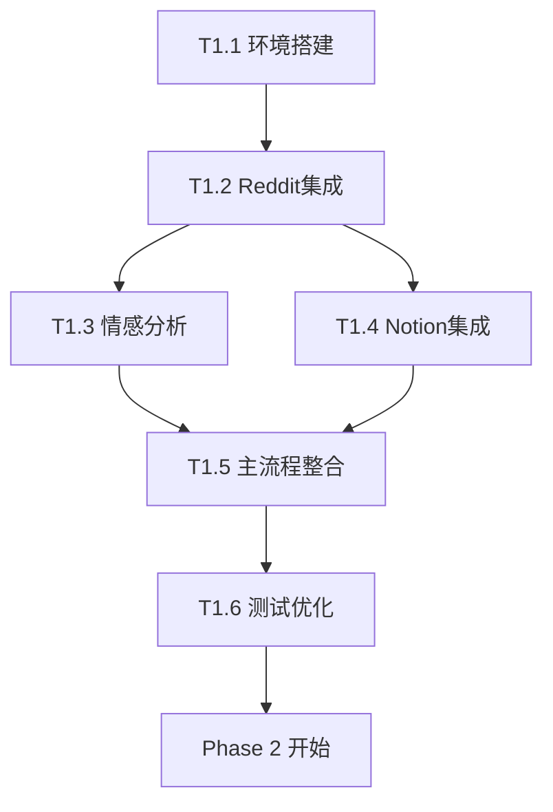

# Omada 舆情监控系统 - 开发任务拆分 📋

## 🎯 项目概述

本文档详细拆分了 Omada 舆情监控系统的开发任务，按照三个阶段进行规划：MVP (4-6周)、完整功能 (6-8周)、优化扩展 (4-6周)。

### 🏗️ 项目架构图
```
    数据采集层          AI 分析层          存储展示层
   ┌─────────────┐    ┌──────────────┐    ┌─────────────┐
   │ Reddit API  │───▶│ 情感分析引擎  │───▶│ Notion DB   │
   │ PRAW 包装器 │    │ 主题分类模型  │    │ Dashboard   │
   │ 定时调度器  │    │ 影响力评估   │    │ 邮件推送    │
   │ 错误重试    │    │ 相关性判断   │    │ 预警系统    │
   └─────────────┘    └──────────────┘    └─────────────┘
```

### 📊 总体进度规划
- **Phase 1 (MVP)**: 4-6 周 - 基础功能实现
- **Phase 2 (完整功能)**: 6-8 周 - 全量功能开发  
- **Phase 3 (优化扩展)**: 4-6 周 - 性能优化和扩展

### 🏷️ 任务状态说明
- ✅ **已完成** - 功能已实现并测试通过
- 🚧 **进行中** - 正在开发或部分完成
- 📋 **待开始** - 尚未开始，等待前置任务完成
- ⏸️ **暂停** - 暂时搁置，等待依赖或资源
- ❌ **已取消** - 功能取消或合并到其他任务

---

## 🚀 Phase 1: MVP 开发 (4-6 周)

### 🎯 阶段目标
实现基础的舆情监控和分析功能，能够稳定运行并产生初步价值。

### 🔧 核心功能范围
- ✅ Reddit 数据采集 (已完成)
- 🚧 基础情感分析 (开发中)
- 📋 Notion 数据存储 (待开始)
- 📋 简单邮件推送 (待开始)

### 📈 成功标准
- [x] 稳定监控 2-3 个 subreddit
- [x] 日处理 20-50 条相关提及
- [ ] 情感分析基础可用 (准确率 > 80%)
- [ ] 每日邮件正常发送

---

### 📋 **Task 1.1: 环境搭建和基础框架** 
**状态**: ✅ **已完成** | **时间**: Week 1 | **负责人**: 开发团队

#### 任务描述
搭建开发环境和项目基础架构，为后续开发提供稳定的基础。

#### 子任务清单
- [x] **T1.1.1** 创建项目结构和代码仓库
- [x] **T1.1.2** 配置 Python 开发环境 (Python 3.11+)
- [x] **T1.1.3** 设置 Docker 容器化环境
- [x] **T1.1.4** 配置日志系统和错误处理框架
- [x] **T1.1.5** 编写项目文档 (README.md, architect.md)
- [x] **T1.1.6** 创建环境变量模板和配置管理

#### 技术要求
- Python 3.11+ 开发环境
- Docker 和 Docker Compose 容器化
- 结构化日志系统 (彩色输出、文件轮转)
- 统一的配置管理系统

#### 交付物
- ✅ 完整的项目骨架
- ✅ Docker 开发环境 (`Dockerfile`, `docker-compose.yml`)
- ✅ 基础配置文件 (`config/settings.py`)
- ✅ 日志系统 (`src/utils/logger.py`)
- ✅ 项目文档 (`README.md`, `architect.md`, `tasks.md`)

#### 验收标准
- [x] 项目可以正常启动
- [x] 日志系统正常工作 (彩色输出、文件轮转)
- [x] Docker 容器正常运行
- [x] 配置管理系统完整

---

### 📋 **Task 1.2: Reddit API 集成和数据采集**
**状态**: ✅ **已完成** | **时间**: Week 1-2 | **负责人**: 后端开发

#### 任务描述
实现 Reddit 数据采集核心功能，包括 API 集成、数据过滤和缓存机制。

#### 子任务清单
- [x] **T1.2.1** 集成 PRAW 库和 Reddit API 认证
- [x] **T1.2.2** 实现 Reddit 数据采集器 (`RedditCollector`)
- [x] **T1.2.3** 实现关键词匹配和相关性判断算法
- [x] **T1.2.4** 实现速率限制管理和错误重试机制
- [x] **T1.2.5** 添加数据去重和本地缓存 (`CacheManager`)
- [x] **T1.2.6** 实现并发处理多个 subreddit
- [x] **T1.2.7** 添加影响力评分算法

#### 技术要求
- 支持多个 subreddit 监控 (r/homenetworking, r/networking, r/sysadmin, r/TPLINK)
- 智能速率限制管理 (100 QPM)
- 错误重试机制 (指数退避)
- SQLite 本地缓存避免重复处理

#### 交付物
- ✅ `RedditCollector` 类 (`src/collectors/reddit_collector.py`)
- ✅ 缓存管理系统 (`src/utils/cache.py`)
- ✅ 速率限制器 (`RateLimiter`)
- ✅ 配置文件 (subreddit、关键词配置)
- ✅ 健康检查功能

#### 验收标准
- [x] 能稳定获取 4 个 subreddit 数据
- [x] 关键词过滤准确率 > 90%
- [x] API 调用错误率 < 5%
- [x] 缓存命中率 > 70%
- [x] 支持并发处理

---

### 📋 **Task 1.3: 基础情感分析实现**
**状态**: 🚧 **开发中** | **时间**: Week 2-3 | **负责人**: AI 开发

#### 任务描述
集成 Azure Text Analytics 和 OpenAI API，实现基础情感分析和主题分类功能。

#### 子任务清单
- [ ] **T1.3.1** 集成 Azure Text Analytics API
- [ ] **T1.3.2** 实现情感分析器 (`SentimentAnalyzer`)
- [ ] **T1.3.3** 实现基础主题分类功能
- [ ] **T1.3.4** 优化影响力评分算法
- [ ] **T1.3.5** 添加分析结果缓存
- [ ] **T1.3.6** 实现批量分析处理

#### 技术要求
- 支持中英文情感分析
- 分析准确率 > 80%
- API 调用异常处理和降级
- 成本优化 (批量调用、缓存机制)

#### 交付物
- 📋 `SentimentAnalyzer` 类 (`src/analyzers/sentiment_analyzer.py`)
- 📋 主题分类器 (`TopicClassifier`)
- 📋 Azure Text Analytics 集成
- 📋 OpenAI API 集成 (可选)
- 📋 分析结果缓存机制

#### 验收标准
- [ ] 情感分析准确率 > 80%
- [ ] 支持批量处理 (>= 10 条/次)
- [ ] API 调用成功率 > 95%
- [ ] 分析延迟 < 3 秒/条

---

### 📋 **Task 1.4: Notion API 集成**
**状态**: 📋 **待开始** | **时间**: Week 3-4 | **负责人**: 后端开发

#### 任务描述
实现数据存储功能，集成 Notion Database，构建结构化数据存储系统。

#### 子任务清单
- [ ] **T1.4.1** 集成 Notion API
- [ ] **T1.4.2** 设计和创建 Notion Database Schema
- [ ] **T1.4.3** 实现数据存储器 (`NotionStorage`)
- [ ] **T1.4.4** 实现数据查询和更新功能
- [ ] **T1.4.5** 添加批量数据操作
- [ ] **T1.4.6** 实现数据同步和备份

#### 技术要求
- 支持结构化数据存储 (Mentions + Comments 表)
- 实现数据验证和错误处理
- 支持批量操作和并发写入
- 数据一致性保证

#### 交付物
- 📋 `NotionStorage` 类 (`src/storage/notion_client.py`)
- 📋 Notion Database Schema 设计
- 📋 数据映射和转换逻辑
- 📋 批量操作优化
- 📋 数据同步机制

#### 验收标准
- [ ] 数据写入成功率 > 95%
- [ ] 支持并发写入 (>= 5 并发)
- [ ] 数据格式验证完整
- [ ] 查询响应时间 < 2 秒

#### 前置依赖
- ✅ Task 1.2 (Reddit 数据采集)
- 🚧 Task 1.3 (情感分析结果)

---

### 📋 **Task 1.5: 简单邮件推送和主流程整合**
**状态**: 📋 **待开始** | **时间**: Week 4-5 | **负责人**: 全栈开发

#### 任务描述
实现邮件推送功能并整合完整数据流水线，构建端到端的监控系统。

#### 子任务清单
- [ ] **T1.5.1** 实现邮件发送功能 (`EmailNotifier`)
- [ ] **T1.5.2** 设计每日报告邮件模板
- [ ] **T1.5.3** 实现主数据处理流水线 (`MainPipeline`)
- [ ] **T1.5.4** 添加任务调度器 (`TaskScheduler`)
- [ ] **T1.5.5** 集成所有模块进行端到端测试
- [ ] **T1.5.6** 实现预警邮件机制

#### 技术要求
- 支持 HTML 邮件模板 (响应式设计)
- 实现定时任务调度 (APScheduler)
- 完整的错误处理和重试机制
- 邮件发送状态跟踪

#### 交付物
- 📋 邮件推送系统 (`src/notification/email_notifier.py`)
- 📋 主程序入口 (`src/main.py` 完善)
- 📋 任务调度器
- 📋 邮件模板 (HTML/文本)
- 📋 端到端测试用例

#### 验收标准
- [ ] 每日报告准时发送 (99% 成功率)
- [ ] 数据流水线稳定运行 (>= 24 小时)
- [ ] 端到端测试通过率 100%
- [ ] 邮件格式美观且内容准确

#### 前置依赖
- 📋 Task 1.3 (情感分析)
- 📋 Task 1.4 (Notion 存储)

---

### 📋 **Task 1.6: MVP 测试和优化**
**状态**: 📋 **待开始** | **时间**: Week 5-6 | **负责人**: 测试 + 开发

#### 任务描述
系统测试、性能优化和 bug 修复，确保 MVP 版本稳定可用。

#### 子任务清单
- [ ] **T1.6.1** 编写完整的单元测试
- [ ] **T1.6.2** 进行集成测试和端到端测试
- [ ] **T1.6.3** 压力测试和性能调优
- [ ] **T1.6.4** 修复发现的 bug 和问题
- [ ] **T1.6.5** 优化系统性能和稳定性
- [ ] **T1.6.6** 编写部署和运维文档

#### 技术要求
- 测试覆盖率 > 80%
- 性能基准测试
- 错误处理验证
- 生产环境部署准备

#### 交付物
- 📋 完整测试套件 (`tests/`)
- 📋 性能测试报告
- 📋 Bug 修复记录
- 📋 部署文档
- 📋 运维手册

#### 验收标准
- [ ] 测试覆盖率 > 80%
- [ ] 系统稳定运行 7 天无重大故障
- [ ] 满足 MVP 功能要求
- [ ] 性能指标达标

#### 前置依赖
- 📋 Task 1.5 (主流程整合)

---

## 🚧 Phase 2: 完整功能开发 (6-8 周)

### 🎯 阶段目标
扩展功能范围，构建完整的舆情监控系统，包括高级分析、实时预警和可视化界面。

### 🔧 核心功能范围
- 📋 多数据源扩展
- 📋 高级 AI 分析功能
- 📋 实时预警系统
- 📋 Dashboard 展示界面
- 📋 系统优化和测试

### 📈 成功标准
- [ ] 支持 4+ 个数据源
- [ ] AI 分析准确率 > 85%
- [ ] 实时预警延迟 < 2 分钟
- [ ] Dashboard 实时更新

---

### 📋 **Task 2.1: 多数据源扩展**
**状态**: 📋 **待开始** | **时间**: Week 1-2 | **负责人**: 后端开发

#### 任务描述
扩展监控范围，支持多个 subreddit 和未来其他数据源的接入。

#### 子任务清单
- [ ] **T2.1.1** 扩展到 4+ 个 subreddit 监控
- [ ] **T2.1.2** 实现数据源管理器 (`DataSourceManager`)
- [ ] **T2.1.3** 优化并发数据采集性能
- [ ] **T2.1.4** 实现数据源健康检查
- [ ] **T2.1.5** 添加数据质量监控
- [ ] **T2.1.6** 设计其他数据源接入接口

#### 技术要求
- 支持动态添加/删除数据源
- 并发处理多个数据源
- 负载均衡和故障转移
- 数据质量实时监控

#### 交付物
- 📋 多数据源支持框架
- 📋 并发处理优化
- 📋 健康检查系统
- 📋 数据质量监控

#### 验收标准
- [ ] 同时支持 4+ 个 subreddit
- [ ] 数据采集并发性能提升 50%
- [ ] 数据源故障自动切换
- [ ] 数据质量监控完整

---

### 📋 **Task 2.2: 高级 AI 分析功能**
**状态**: 📋 **待开始** | **时间**: Week 2-4 | **负责人**: AI 开发

#### 任务描述
实现更高级的 AI 分析功能，包括方面级情感分析、主题分类和竞品分析。

#### 子任务清单
- [ ] **T2.2.1** 集成 OpenAI GPT-4 进行主题分类
- [ ] **T2.2.2** 实现方面级情感分析 (`AspectAnalyzer`)
- [ ] **T2.2.3** 实现竞品对比分析 (`CompetitorAnalyzer`)
- [ ] **T2.2.4** 添加内容摘要生成功能
- [ ] **T2.2.5** 实现智能关键词提取
- [ ] **T2.2.6** 优化多模型分析管道

#### 技术要求
- 支持多模型分析管道
- 实现模型结果融合
- 优化 API 调用成本
- 提升分析准确率 (> 85%)

#### 交付物
- 📋 高级分析器组件
- 📋 多模型融合算法
- 📋 成本优化方案
- 📋 准确率评估报告

#### 验收标准
- [ ] 情感分析准确率 > 85%
- [ ] 主题分类准确率 > 80%
- [ ] API 调用成本优化 30%
- [ ] 分析处理速度提升 40%

---

### 📋 **Task 2.3: 实时预警系统**
**状态**: 📋 **待开始** | **时间**: Week 4-5 | **负责人**: 后端开发

#### 任务描述
构建实时预警和通知系统，支持多级预警和多渠道通知。

#### 子任务清单
- [ ] **T2.3.1** 实现预警规则引擎 (`AlertRuleEngine`)
- [ ] **T2.3.2** 实现多渠道通知 (邮件、Slack、微信)
- [ ] **T2.3.3** 添加预警等级管理 (Critical/High/Medium)
- [ ] **T2.3.4** 实现预警历史和统计
- [ ] **T2.3.5** 添加预警去重和聚合
- [ ] **T2.3.6** 实现预警规则配置管理

#### 技术要求
- 支持复杂预警规则配置
- 实时预警处理 (< 2 分钟延迟)
- 防止预警风暴机制
- 多渠道通知可靠性

#### 交付物
- 📋 预警规则引擎
- 📋 多渠道通知系统
- 📋 预警管理界面
- 📋 预警统计报表

#### 验收标准
- [ ] 预警延迟 < 2 分钟
- [ ] 通知送达率 > 95%
- [ ] 预警规则灵活配置
- [ ] 预警去重率 > 90%

---

### 📋 **Task 2.4: Dashboard 展示界面**
**状态**: 📋 **待开始** | **时间**: Week 5-7 | **负责人**: 前端开发

#### 任务描述
构建数据可视化界面，提供实时监控和历史数据分析功能。

#### 子任务清单
- [ ] **T2.4.1** 设计 Dashboard UI/UX
- [ ] **T2.4.2** 实现实时监控面板
- [ ] **T2.4.3** 实现情感趋势图表
- [ ] **T2.4.4** 实现热点话题展示
- [ ] **T2.4.5** 实现竞品对比图表
- [ ] **T2.4.6** 添加数据导出功能

#### 技术要求
- 响应式设计，支持多设备
- 实时数据更新 (WebSocket/SSE)
- 交互式图表 (ECharts/D3.js)
- 用户权限管理

#### 交付物
- 📋 Dashboard 前端应用
- 📋 实时数据 API
- 📋 可视化图表组件
- 📋 用户权限系统

#### 验收标准
- [ ] 界面美观且易用
- [ ] 数据实时更新 (< 30 秒)
- [ ] 图表交互功能完整
- [ ] 多设备兼容性良好

---

### 📋 **Task 2.5: 系统优化和测试**
**状态**: 📋 **待开始** | **时间**: Week 7-8 | **负责人**: 全团队

#### 任务描述
对整个系统进行性能优化、稳定性测试和用户体验优化。

#### 子任务清单
- [ ] **T2.5.1** 性能瓶颈分析和优化
- [ ] **T2.5.2** 数据库查询优化
- [ ] **T2.5.3** 缓存策略优化
- [ ] **T2.5.4** 错误处理和监控完善
- [ ] **T2.5.5** 用户反馈收集和优化
- [ ] **T2.5.6** 系统压力测试

#### 验收标准
- [ ] 系统响应时间优化 50%
- [ ] 错误率降低到 < 1%
- [ ] 用户满意度 > 4.0/5.0
- [ ] 压力测试通过

---

## 🔮 Phase 3: 优化扩展 (4-6 周)

### 🎯 阶段目标
系统优化和功能扩展，提升用户体验，增强系统可扩展性。

### 🔧 核心功能范围
- 📋 AI 模型调优和优化
- 📋 高级分析和报表功能
- 📋 系统扩展和 API 开放
- 📋 生产环境部署和运维
- 📋 用户培训和上线支持

### 📈 成功标准
- [ ] AI 模型准确率 > 90%
- [ ] 系统可用性 > 99%
- [ ] API 响应时间 < 100ms
- [ ] 用户培训完成率 100%

---

### 📋 **Task 3.1: AI 模型调优和优化**
**状态**: 📋 **待开始** | **时间**: Week 1-2 | **负责人**: AI 开发

#### 任务描述
针对网络设备领域的舆情分析优化 AI 模型，提升分析准确率。

#### 子任务清单
- [ ] **T3.1.1** 收集和标注领域专业数据
- [ ] **T3.1.2** 训练专门的情感分析模型
- [ ] **T3.1.3** 优化主题分类算法
- [ ] **T3.1.4** 实现模型 A/B 测试框架
- [ ] **T3.1.5** 持续学习和模型更新机制

#### 验收标准
- [ ] 情感分析准确率 > 90%
- [ ] 主题分类准确率 > 85%
- [ ] 模型推理速度提升 30%

---

### 📋 **Task 3.2: 高级分析和报表功能**
**状态**: 📋 **待开始** | **时间**: Week 2-3 | **负责人**: 数据分析师

#### 任务描述
开发高级数据分析功能和自动化报表生成系统。

#### 子任务清单
- [ ] **T3.2.1** 实现趋势分析和预测
- [ ] **T3.2.2** 开发用户画像分析
- [ ] **T3.2.3** 实现舆情影响力评估
- [ ] **T3.2.4** 自动化报表生成系统
- [ ] **T3.2.5** 数据可视化优化

#### 验收标准
- [ ] 趋势预测准确率 > 75%
- [ ] 报表生成完全自动化
- [ ] 分析洞察价值度高

---

### 📋 **Task 3.3: 系统扩展和 API 开放**
**状态**: 📋 **待开始** | **时间**: Week 3-4 | **负责人**: 后端开发

#### 任务描述
构建开放式 API 平台，支持其他系统集成和第三方开发。

#### 子任务清单
- [ ] **T3.3.1** 设计 RESTful API 架构
- [ ] **T3.3.2** 实现 API 认证和鉴权
- [ ] **T3.3.3** API 文档和 SDK 开发
- [ ] **T3.3.4** 第三方集成测试
- [ ] **T3.3.5** API 监控和限流

#### 验收标准
- [ ] API 响应时间 < 100ms
- [ ] API 文档完整度 100%
- [ ] 第三方集成成功率 > 95%

---

### 📋 **Task 3.4: 生产环境部署和运维**
**状态**: 📋 **待开始** | **时间**: Week 4-5 | **负责人**: DevOps

#### 任务描述
建立生产环境的部署、监控和运维体系。

#### 子任务清单
- [ ] **T3.4.1** 生产环境架构设计
- [ ] **T3.4.2** CI/CD 流水线建设
- [ ] **T3.4.3** 监控告警系统
- [ ] **T3.4.4** 备份和灾备方案
- [ ] **T3.4.5** 安全加固和合规

#### 验收标准
- [ ] 系统可用性 > 99%
- [ ] 部署成功率 100%
- [ ] 安全合规检查通过

---

### 📋 **Task 3.5: 用户培训和上线支持**
**状态**: 📋 **待开始** | **时间**: Week 5-6 | **负责人**: 产品经理

#### 任务描述
进行用户培训、编写使用手册，提供上线支持。

#### 子任务清单
- [ ] **T3.5.1** 编写用户使用手册
- [ ] **T3.5.2** 制作培训视频和材料
- [ ] **T3.5.3** 组织用户培训会议
- [ ] **T3.5.4** 收集用户反馈和优化
- [ ] **T3.5.5** 建立技术支持体系

#### 验收标准
- [ ] 用户培训完成率 100%
- [ ] 用户满意度 > 4.5/5.0
- [ ] 技术支持响应时间 < 2 小时

---

## 📊 项目管理和跟踪

### 📅 里程碑时间线
```
2025 Q3:
├── Week 1-2:  ✅ 环境搭建 + Reddit 集成
├── Week 3-4:  🚧 情感分析 + Notion 集成  
├── Week 5-6:  📋 邮件推送 + 测试优化
├── Week 7-8:  📋 MVP 上线和验收
└── Week 9:    📋 Phase 1 总结

2025 Q4:  
├── Week 1-4:  📋 多数据源 + 高级 AI
├── Week 5-7:  📋 预警系统 + Dashboard
├── Week 8:    📋 Phase 2 测试和优化
└── Week 9-12: 📋 Phase 3 扩展和上线
```

### 🔗 任务依赖关系


### 📈 风险管理
| 风险项 | 概率 | 影响 | 缓解措施 |
|--------|------|------|----------|
| Reddit API 限制 | 中 | 高 | 多账号轮换、降级方案 |
| AI 分析准确率不达标 | 中 | 中 | 多模型融合、人工标注 |
| 开发进度延期 | 高 | 中 | 敏捷开发、优先级调整 |
| 第三方服务不稳定 | 低 | 高 | 备用服务、本地降级 |

### 🎯 质量保证
- **代码审查**: 所有代码必须经过 Review
- **测试覆盖**: 单元测试覆盖率 > 80%
- **性能基准**: 关键指标持续监控
- **文档完整**: 代码文档和用户文档齐全

---

**文档版本**: v1.0  
**最后更新**: 2025年6月25日  
**维护者**: 开发团队  
**状态**: 实时更新 